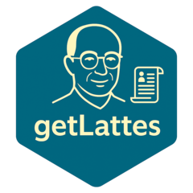

<!-- README.md is generated from README.Rmd. Please edit that file -->

# getLattes <a href="https://roneyfraga.com/getLattes/"></a>

<!-- badges: start -->

[](https://zenodo.org/badge/latestdoi/258844181)
[](https://cran.r-project.org/package=getLattes)
[](https://www.repostatus.org/#active)
[](https://github.com/roneyfraga/getLattes/actions/workflows/R-CMD-check.yaml)
[](https://cran.r-project.org/package=getLattes)
[](https://cran.r-project.org/package=getLattes)
[](https://cran.r-project.org/package=getLattes)
[](https://www.gnu.org/licenses/gpl-3.0)
<!-- badges: end -->

The `getLattes` `R` package, written by [Roney Fraga
Souza](http://roneyfraga.com), [Winicius
Sabino](https://stackoverflow.com/users/9278241/winicius-sabino) and
[Luis Felipe de Souza
Rodrigues](http://lattes.cnpq.br/5404832707334563/), was built to
extract data from the [Lattes](http://lattes.cnpq.br/) curriculum
platform exported as `XML`.


To automate the download process, please see [Captchas Negated by Python
reQuests - CNPQ](https://github.com/josefson/CNPQ).

## getLattesWeb

Non-programmers alternative, use the `getLattesWeb` graphical interface:

- link 1 <https://roneyfraga.shinyapps.io/getlattesweb/>
- link 2
  [http://roneyfraga.com/shiny/getLattesWeb/](http://roneyfraga.com/getLattesWeb/)


## Programmers

### Installation

Stable version from [CRAN](https://cran.r-project.org/).

``` r
install.packages('getLattes')
library(getLattes)
```

Development version from
[GitHub](https://github.com/roneyfraga/getLattes).

``` r
# install and load devtools from CRAN
# install.packages("devtools")
library(devtools)

# install and load getLattes
devtools::install_github("roneyfraga/getLattes")
library(getLattes)
```

### Import XML file

The Lattes XML file can be compressed inside a `.zip`.

``` r
# find the file in system
zip_xml <- system.file('extdata/4984859173592703.zip', package = 'getLattes')

curriculo <- xml2::read_xml(zip_xml)
```

### Extract data

``` r
# to extract data from one curriculum 
getDadosGerais(curriculo)
getArtigosAceitos(curriculo)
getArtigosPublicados(curriculo)
getAreasAtuacao(curriculo)
getArtigosPublicados(curriculo)
getAtuacoesProfissionais(curriculo)
getBancasDoutorado(curriculo)
getBancasGraduacao(curriculo)
getBancasMestrado(curriculo)
getCapitulosLivros(curriculo)
getDadosGerais(curriculo)
getEnderecoProfissional(curriculo)
getEventosCongressos(curriculo)
getFormacaoDoutorado(curriculo)
getFormacaoMestrado(curriculo)
getFormacaoGraduacao(curriculo)
getIdiomas(curriculo)
getLinhaPesquisa(curriculo)
getLivrosPublicados(curriculo)
getOrganizacaoEventos(curriculo)
getOrientacoesDoutorado(curriculo)
getOrientacoesMestrado(curriculo)
getOrientacoesPosDoutorado(curriculo)
getOutrasProducoesTecnicas(curriculo)
getParticipacaoProjeto(curriculo)
getProducaoTecnica(curriculo)
getProducaoTecnica(curriculo)
getTrabalhosEmEventos()
getId(curriculo)
```
